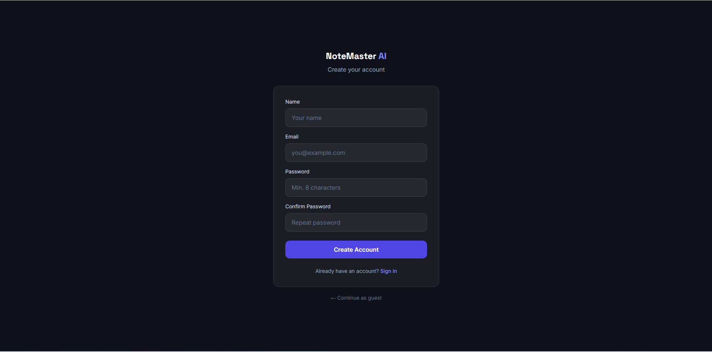
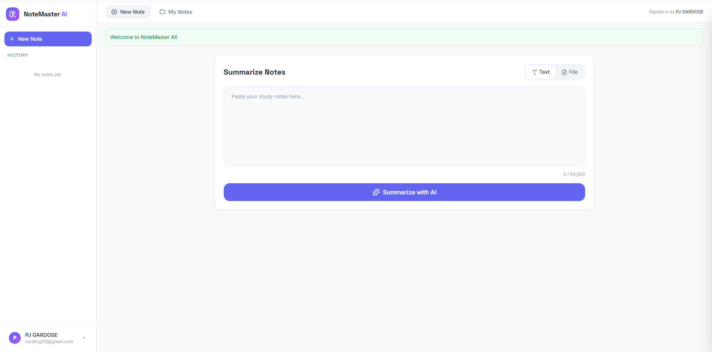

# 🧠 NoteMaster AI — Smart Study Assistant

> **📦 Public Repository:** `https://github.com/YOUR-USERNAME/notemaster-ai`
> *(Replace this link with your actual GitHub repository URL before submission)*

---

## 📌 Project Overview

**NoteMaster AI** is an intelligent, web-based study assistant built with **Laravel 11** as the final project for [Your Course Name / Subject]. It leverages the **Google Gemini 2.5 Flash API** to help students study smarter — not harder.

### ✨ Key Features

| Feature | Description |
|---|---|
| 🤖 AI Summarization | Paste notes or upload a PDF/TXT file and get a clean, structured AI-generated summary |
| 💬 AI Chat | Ask follow-up questions about any note in a context-aware chat drawer |
| 📝 Quiz Generator | Auto-generate a 5-question multiple-choice quiz from any saved note |
| 🏷️ Tag System | Create color-coded tags and filter your notes by topic |
| 👤 Guest Mode | Try summarization and chat without creating an account |
| 🔐 Authentication | Full register / login / logout flow using Laravel's built-in Auth |

### 🛠️ Tech Stack

| Layer | Technology |
|---|---|
| Backend Framework | Laravel 11 (PHP 8.2) |
| Frontend | Blade Templates, Tailwind CSS (CDN), Vanilla JavaScript |
| Database | MySQL (production) / SQLite (local development) |
| AI Provider | Google Gemini 2.5 Flash API |
| Icons | Lucide Icons |
| HTTP Client | Laravel Http (Guzzle wrapper) |

---

## 📸 Application Screenshots

### Login Screen


*The clean login screen with links to register a new account.*

### Main Dashboard — Summarize Notes


*Paste notes or upload a PDF/TXT file to receive an AI-generated summary.*

### Side-by-Side Summary View


*Original text and AI summary displayed side-by-side for easy comparison.*

### AI Chat Drawer


*The slide-in chat drawer for asking context-aware questions about a note.*

### Quiz Generator


*Auto-generated multiple-choice quiz with immediate green/red visual feedback.*

### My Notes Grid


*The notes library with search, tag filtering, and clickable note cards.*
---

## ✅ Prerequisites

Make sure the following are installed on your machine before proceeding.

| Requirement | Version | Check Command |
|---|---|---|
| PHP | 8.2 or higher | `php --version` |
| Composer | 2.x | `composer --version` |
| Node.js | 18.x or higher | `node --version` |
| npm | 9.x or higher | `npm --version` |
| MySQL | 8.x (or SQLite) | `mysql --version` |
| Git | Any recent version | `git --version` |

> **Google Gemini API Key** — You also need a free API key from [Google AI Studio](https://aistudio.google.com/app/apikey).

---

## 🚀 Installation & Setup

Follow these steps **in order** to get NoteMaster AI running on your local machine.

### Step 1 — Clone the Repository

```bash
git clone https://github.com/YOUR-USERNAME/notemaster-ai.git
cd notemaster-ai
```

### Step 2 — Install PHP Dependencies

```bash
composer install
```

### Step 3 — Install JavaScript Dependencies

```bash
npm install
```

### Step 4 — Create the Environment File

```bash
cp .env.example .env
```

### Step 5 — Generate the Application Key

```bash
php artisan key:generate
```

### Step 6 — Configure Your `.env` File

Open `.env` in your editor and update the following values:

```dotenv
# ── App ──────────────────────────────────────
APP_NAME="NoteMaster AI"
APP_URL=http://127.0.0.1:8000

# ── Database (MySQL) ─────────────────────────
DB_CONNECTION=mysql
DB_HOST=127.0.0.1
DB_PORT=3306
DB_DATABASE=notemaster
DB_USERNAME=root
DB_PASSWORD=your_mysql_password

# ── Google Gemini API ─────────────────────────
GEMINI_API_KEY=your_actual_gemini_api_key_here
GEMINI_MODEL=gemini-2.5-flash
```

> **SQLite Alternative:** If you prefer SQLite (no MySQL setup needed), set `DB_CONNECTION=sqlite` and create the file with `touch database/database.sqlite`.

### Step 7 — Create the MySQL Database

If using MySQL, create the database first:

```bash
mysql -u root -p -e "CREATE DATABASE notemaster CHARACTER SET utf8mb4 COLLATE utf8mb4_unicode_ci;"
```

### Step 8 — Run Migrations and Seed the Database

>  This is the key step — it creates all tables **and** populates the database with realistic dummy data.

```bash
php artisan migrate --seed
```

This command will:
- Create all tables: `users`, `notes`, `tags`, `messages`, `note_tag`
- Seed **1 admin test account** + 5 dummy users
- Seed **10 realistic study notes** with AI-style summaries
- Seed **5 color-coded study tags** (Science, History, Math, Literature, Urgent)
- Attach random tags to notes

### Step 9 — Link the Storage (for file uploads)

```bash
php artisan storage:link
```

### Step 10 — Start the Development Server

Open **two terminal windows** and run one command in each:

**Terminal 1 — Laravel backend:**
```bash
php artisan serve
```

**Terminal 2 — Vite frontend (for asset compilation):**
```bash
npm run dev
```

The app will be available at: **http://127.0.0.1:8000**

---

##  Test Login Credentials

After running `php artisan migrate --seed`, use these credentials to log in immediately:

| Field | Value |
|---|---|
| Email | `admin@notemaster.com` |
| Password | `password` |

---

## 🗄️ Database Schema

### Entity Relationship Overview

```
users ──────< notes ──────< messages
               │
               └──────< note_tag >────── tags
```

### Tables

| Table | Description |
|---|---|
| `users` | Registered user accounts (id, name, email, password) |
| `notes` | AI-generated summaries linked to a user (id, user_id, title, original_content, summary) |
| `tags` | Color-coded labels (id, name, color) |
| `note_tag` | Pivot table linking notes to tags (many-to-many) |
| `messages` | AI chat history per note (id, note_id, role, content) |

---

##  API Endpoints

| Method | Endpoint | Auth Required | Description |
|---|---|---|---|
| `POST` | `/api/summarize` | No | Summarize text or uploaded file |
| `GET` | `/api/notes` | ✅ Yes | List all notes for the logged-in user |
| `GET` | `/api/notes/{note}` | ✅ Yes | Get a single note with tags |
| `DELETE` | `/api/notes/{note}` | ✅ Yes | Delete a note |
| `POST` | `/api/notes/{note}/chat` | ✅ Yes | Send a chat message about a note |
| `GET` | `/api/notes/{note}/chat` | ✅ Yes | Get chat history for a note |
| `POST` | `/api/guest-chat` | No | Stateless guest chat (not saved) |
| `GET` | `/api/tags` | No | List all available tags |
| `POST` | `/api/tags` | ✅ Yes | Create a new tag |
| `POST` | `/api/notes/{note}/tags` | ✅ Yes | Attach a tag to a note |
| `DELETE` | `/api/notes/{note}/tags/{tag}` | ✅ Yes | Remove a tag from a note |
| `POST` | `/api/notes/{note}/quiz` | ✅ Yes | Generate a 5-question quiz from a note |

---

##  Project Structure

```
app/
├── Http/Controllers/
│   ├── AuthController.php       # register, login, logout
│   ├── NoteController.php       # summarize, index, show, destroy
│   ├── ChatController.php       # send, guestChat, history
│   ├── TagController.php        # index, store, attach, detach
│   └── QuizController.php       # generate quiz from note
├── Models/
│   ├── User.php                 # hasMany(Note)
│   ├── Note.php                 # belongsTo(User), hasMany(Message), belongsToMany(Tag)
│   ├── Tag.php                  # belongsToMany(Note)
│   └── Message.php              # belongsTo(Note)
└── Services/
    ├── AiService.php            # Gemini API — summary + chat
    └── FileParserService.php    # PDF / TXT text extraction

database/
├── migrations/                  # All table definitions
├── seeders/
│   ├── DatabaseSeeder.php
│   ├── UserSeeder.php
│   ├── TagSeeder.php
│   └── NoteSeeder.php
└── factories/
    ├── UserFactory.php
    └── NoteFactory.php

public/js/
└── script.js                    # All frontend logic (auth, summarize, chat, quiz)

resources/views/
├── index.blade.php              # Main single-page app view
└── auth/
    ├── login.blade.php
    └── register.blade.php
```

---

##  Common Issues & Fixes

| Error | Fix |
|---|---|
| `SQLSTATE: Access denied` | Check `DB_USERNAME` and `DB_PASSWORD` in `.env` |
| `Class "OpenSSL" not found` | Enable `extension=openssl` in your `php.ini` |
| `Target class [Controller] does not exist` | Run `composer dump-autoload` |
| `GEMINI_API_KEY` missing / 403 | Generate a key at [aistudio.google.com](https://aistudio.google.com/app/apikey) |
| Blank page after `npm run dev` | Make sure both terminals (artisan serve + npm run dev) are running |
| File upload not working | Run `php artisan storage:link` |
| `php_fileinfo` extension error | Enable `extension=fileinfo` in `php.ini` |

---

##  Members of the Group

<div align="center">

**Pearl Kristian M. Gardose** — Front and Backend Programmer  
**Henry Philip S. Dael** — Quality Assurance  
**Stephanie Princess Grace S. Aniag** — Project Manager  
**Keegan Jeoff Liboon** — Documentation

</div>


*NoteMaster AI — Study smarter, and Study better.*